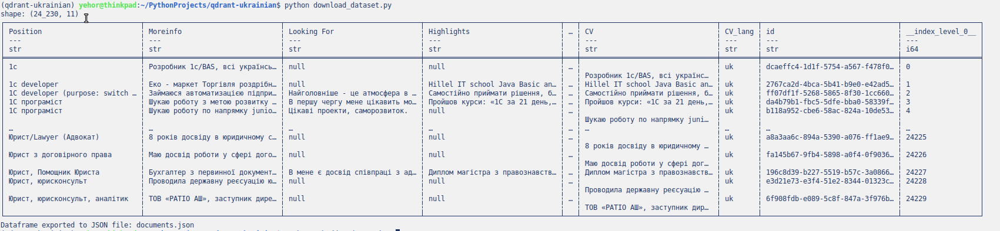
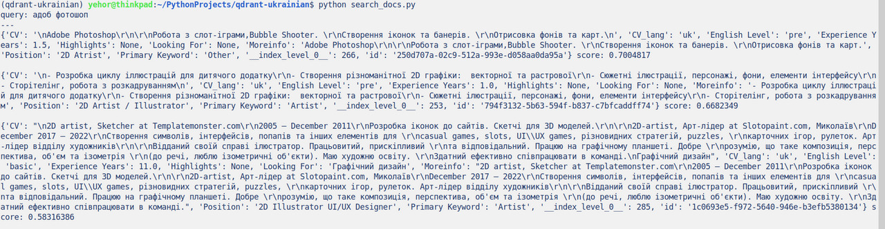

# Test Qdrant vector similarity search engine for Ukrainian

Dataset:



Search result:



---

Tested with Qdrant 1.10.0

## Install deps

### Create an env

```
uv venv
```

### Activate the env

```
source .venv/bin/activate
```

### Install libraries

```
uv pip install qdrant-client sentence-transformers polars
```

optional:

```
uv pip install ruff
```

## Run

### Start qdrant server

```
docker run -p 6333:6333 qdrant/qdrant
```

### Download dataset and convert from Parquet to JSON

```
python download_dataset.py
```

### Embedd docs

```
python embedd_docs.py
```

Also, you can see them in the UI: http://localhost:6333/dashboard

### Search docs

```
python search_docs.py
```

## Lint and format the code

```
ruff check
ruff format
```
